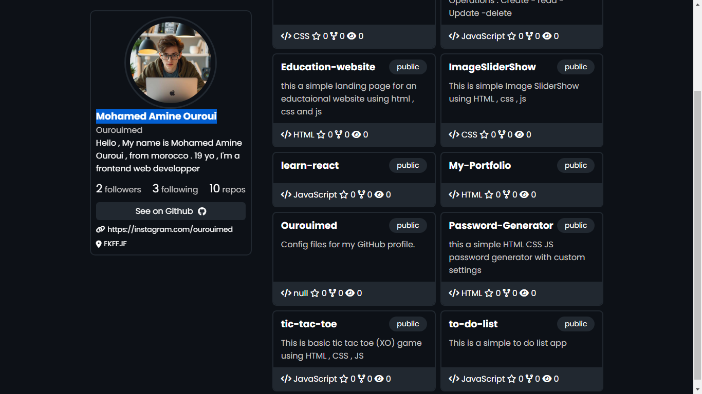

## Github Profile Card Api 


Simple Github Profile HTML CSS JS Using Github APi data
# Instalation
1- Clone or download this repositories 
```bash
git clone 'https://github.com/Ourouimed/github-profile.git'
```

2- open main.js file and replace `ourouimed` by your own github username (line 2)

3 - open the index.html file to see the results

# Usage
Using the github API Data you can access :
- users profile data (name , login , bio ...)
- Followers & Following
- User public repositories
- stared & forked repos ..

# Live Demo 
For more , please check the App live preview [here](https://ourouimed.github.io/github-profile)

